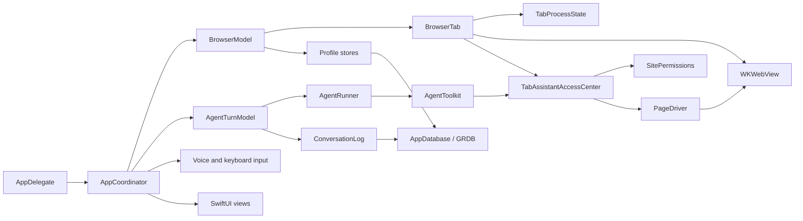

# Architecture

Linen is a macOS SwiftUI app around WebKit. Swift 6 strict concurrency and
Main Actor default isolation are enabled for the app target.

## Runtime shape

`AppCoordinator` owns the running feature graph. Views observe the coordinator
and its focused models; they should not contain persistence, networking or
WebKit policy. New work should prefer a narrow model or protocol over another
coordinator responsibility.

`VoiceInputModel` owns microphone and transcription state. `AgentTurnModel`
owns one turn’s task, reply, tab activity and durable completion state. Both
models expose small observable values while their service dependencies stay
outside observation.

## Browser state

`BrowserModel` owns tab and folder order, activation, session restoration and
history integration. `BrowserTab` owns one page’s observable state and WebKit
lifecycle. `TabProcessState` owns process-protection signals, unload status and
unexpected-termination throttling. `WebViewPool` prepares reusable views
without owning tab state.

A restored tab holds no `WKWebView` until you open it. `BrowserTab.webView`
builds one on first use and `isMaterialised` reports whether it exists, so a
sweep over every tab must ask before it reaches for the view. A tab that sleeps
under memory pressure keeps a view, but gives up the page and takes a fresh one.
In both cases the title, address, favicon and WebKit interaction state remain, so
activation loads the page again. Code that adds a new kind of in-progress page work must decide whether
that work prevents discarding.

Profiles are hard boundaries. Each profile has its own WebKit data store,
database, permission records and extension directory. Private browsing uses an
ephemeral profile and an in-memory database. Never add profile identity as a
column to a shared persistent store.

`BrowserModel` owns the active profile’s permission store and gives that exact
store to every new `BrowserTab`. A profile switch writes the outgoing session,
drops its tabs without the bookkeeping a single close needs, replaces the
database and permission store together, swaps the extension controller, and
restores the next session. The extensions themselves load afterwards, so the
window is usable first. Each phase logs its own duration under `profile:
switched`.

## Agent trust boundaries

The model is not a security boundary. Page text is untrusted, even when the
model describes it as an instruction.

- `AgentToolkit` exposes the supported browser actions.
- `TabAssistantAccessCenter` authorizes visible-page reads and controls by
  origin before `AgentToolkit` reaches the page driver.
- `PageDriver` resolves actual page elements and enforces sensitive-field and
  consequential-action rules.
- `AgentActionConsent` asks from trusted app UI. The model cannot suppress it.
- `AgentActionPolicy` stores narrow, revocable category-and-host grants.
- `ConversationLog` persists the activity trail inside the active profile.

Background research uses a non-persistent WebKit data store for each task. It
does not inherit cookies, logins or website storage from the active profile.
Loading the chosen result into a tab does not grant the assistant access to it.

Add enforcement below the model prompt. Prompts can improve behavior but cannot
authorize access, protect credentials or confirm an irreversible action.

## State and SwiftUI

Shared mutable models use Observation. View-local state is private. A distinct
screen or independently changing section should be a real `View` type with
narrow inputs; a computed `some View` property does not create an observation
boundary.

Use the components and metrics in `Linen/UI/Chrome` and
`Linen/Settings/SettingsPrimitives.swift`. `Theme` owns shared visual tokens.
User-facing strings remain localizable; protocol values, URLs, model IDs and
third-party error text remain verbatim.

## Persistence

GRDB stores structured browser and agent data. Small preferences use
`UserDefaults`; provider secrets use Keychain. File-backed models — profiles,
website permissions, page zoom and the download list — use atomic writes through
the support layer. A write needed for quit or profile teardown
must be awaited or flushed synchronously before its owner is released.

## Tests

Tests use Swift Testing, with XCTest for the two things it cannot express:
performance baselines (`XCTMetric`) and a test that drives the main run loop.
Prefer pure parsing and policy functions, injected stores, temporary databases
and local WebKit fixtures. `HTTPFixtureServer` serves deterministic loopback
pages for navigation and origin-boundary tests. A test should assert a
user-observable result or an enforced invariant. Live services and fixed sleeps
do not belong in the default suite.

A test run keeps its files to itself. `AppDatabase.supportDirectory` answers
with a per-process temporary directory, so profiles, permissions, zoom state and
the download list never touch the support directory of an installed copy.

`WebViewGate` bounds how many cases hold a live `WKWebView` at once, at half the
machine’s cores. The `.boundedWebViews` trait takes a slot; apply it to the
tests that build a view rather than to a whole suite, so the rest do not queue
for a resource they never use.

`Linen.xctestplan` turns on per-test timeouts: 120 seconds by default, 300 at
most. A test that wedges fails by name instead of holding the run.

CI runs the full suite with code coverage and rejects app-target coverage below
the repository floor. See [CONTRIBUTING.md](CONTRIBUTING.md) for the change
checklist.
